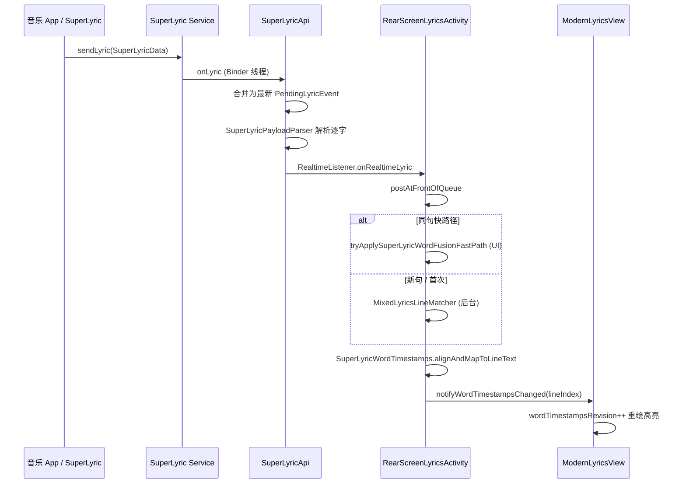

# SuperLyricApi 3.4 逐字接入（MiRoot）

官方仓库：[HChenX/SuperLyricApi](https://github.com/HChenX/SuperLyricApi)（依赖 `com.github.HChenX:SuperLyricApi:3.4`）

MiRoot 为 **接收端**：通过 `ISuperLyricReceiver` 订阅 Binder 推送，将 `SuperLyricWord` 转为 `EnhancedLRCParser.WordTimestamp`，再与网络 LRC 行融合或直接驱动单行 UI。

---

## 1. 官方数据模型 → 本仓库映射

| SuperLyricApi 3.4 | MiRoot 结构 | 说明 |
|-------------------|-------------|------|
| `SuperLyricData.getLyric()` | `SuperLyricPayloadParser.pickBestLyricLineFast` | 主行带逐字则快路径，否则副/翻译打分 |
| `SuperLyricLine.getWords()` | `SuperLyricWord[]` → `List<WordTimestamp>` | `buildWordTimestamps`（融合） |
| `SuperLyricLine` start/end | `lineStartMs` / `lineEndMs` | 仅 SuperLyric 单句：`buildSingleLineDisplayTimeline` |
| `SuperLyricWord(start,end)` | 绝对毫秒 | 行内相对 / 整曲绝对自动判定 |
| `SuperLyricWord(delay)` 仅 delay | 相对游标累加 | 3.4 之前兼容 |
| `SuperLyricLine.startTime/endTime` | `lineStartMs` + 融合锚点 | `resolveLineStartMs/EndMs` |
| `onLyric(publisher, data)` | `SuperLyricApi` → `RealtimeListener` | 回调驱动，无轮询 |

---

## 2. 端到端链路（智能切换 · 逐字融合）

| 阶段 | 类 | 及时性要点 |
|------|-----|------------|
| 注册 | `MiRootApplication` + `addRealtimeListener` + 仅模块拉词 | 与 ModuleDemo 一致：`registerReceiver` 常驻，投屏结束不 `unregister` |
| 解析 | `SuperLyricPayloadParser` | Binder 回调合并，只处理最新包 |
| 融合 | `MixedLyricsLineMatcher` + `SuperLyricWordTimestamps` | 网络行文本不变，只写 `wordTimestamps` |
| 刷新 | `commitSuperLyricWordFusion` | 同句仅首尾相等会跳过；任一字 >36ms 变化即 `notifyWordTimestampsChanged` |
| 同句加速 | `tryApplySuperLyricWordFusionFastPath` | 已融合行 + 文本相似 ≥0.82 时跳过 Matcher 线程池 |

---

## 3. 三种歌词来源模式

| 设置 | 结构来源 | 逐字来源 | 刷新方式 |
|------|----------|----------|----------|
| 网络歌词 | 网络 API | 无 SuperLyric | — |
| 仅 SuperLyric | SuperLyric 单行 | `buildSingleLineDisplayTimeline`（句内 0 基、一字一戳） | 每包 `applySuperLyricFallbackPayload` |
| **智能切换** | 网络 API（≥2 行） | SuperLyric 逐字融合 | 回调 + 快路径 + `notifyWordTimestampsChanged` |

智能切换细则见 [智能歌词融合规则.md](./智能歌词融合规则.md)。

---

## 4. 时间轴解析规则（`SuperLyricPayloadParser`）

1. **逐字字段**：优先 `startTime`/`endTime`；仅 `delay>0` 时按行内游标累加（旧版 App）。
2. **相对 vs 绝对**：`shouldTreatWordsAsLineRelative`  
   - 字末时间 ≤ 行时长 + 2s → 相对行起点  
   - 行起点 ≥120s 且字末 < 行起点 → 行绝对 + 字相对  
   - 无行起点且字末 <120s → 行内相对  
3. **融合写入**：`alignAndMapToLineText(lineTime, networkText, superWords, nextLineTime)`，标点保留、句末有限补长。

---

## 5. 及时刷新：已做优化

| 问题 | 处理 |
|------|------|
| Binder 高频推送排队 | `PENDING_LYRIC_EVENT` + `drainPendingLyricEvents` 只处理最新包 |
| 网络先命中未注册 Receiver | `ensureReceiverRegistered` 在 Application / `addRealtimeListener` |
| 同句只比首尾时间 | `hasMaterialWordTimingChange` 逐字比对 |
| Matcher 线程池延迟 | 同句 `tryApplySuperLyricWordFusionFastPath` 在 UI 线程直接融合 |
| 融合后整表 `setLyrics` 闪屏 | 仅 `notifyWordTimestampsChanged`，不重置 scrollY |

---

## 6. 源码索引

| 文件 | 职责 |
|------|------|
| `SuperLyricApi.java` | Binder 接收、缓存、实时监听、回调合并 |
| `SuperLyricPayloadParser.java` | 3.4 逐字 / delay / 相对绝对时间 |
| `SuperLyricWordTimestamps.java` | 对齐行时间、映射网络文本、实质变化检测 |
| `MixedLyricsLineMatcher.java` | 行级文本比对 |
| `RearScreenLyricsActivity.java` | 来源策略、融合提交、快路径 |
| `ModernLyricsView.java` | `notifyWordTimestampsChanged`、`computeFusedWordHighlightTarget` |

排障见 [SuperLyric接入与排障说明.md](./SuperLyric接入与排障说明.md)（含 Release 必留 `-keep class com.hchen.superlyricapi.** { *; }`）。
