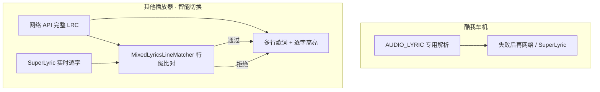

# 智能切换（MIXED）融合规则

设置项为 **智能切换**：除 **酷我车机版**（`cn.kuwo.kwmusiccar`）走 `AUDIO_LYRIC` 专用解析外，其他播放器采用「网络 API 完整歌词 + SuperLyric 逐字时间轴」双源融合。

---

## 1. 总览

| 角色 | 数据源 | 职责 |
|------|--------|------|
| 结构 | 网络 API（LRC） | 多行文本、行时间、滚动与高亮行 |
| 精度 | SuperLyric | 当前句 `wordTimestamps`，对齐到已匹配行 |
| 校验 | `MixedLyricsLineMatcher` | 防止错句、秒跳、用单行覆盖整首 |

---

## 2. 网络 API 优先级（与「网络歌词」一致）

由 `MusicPlayerLyricsPolicy` + `NetworkLyricsOrchestrator` 决定，**按播放器包名**：

| 播放器 | 主源 → 次源 → 开放兜底 |
|--------|-------------------------|
| 汽水 `com.luna.music` | **智能切换**：单句先显 → 仅 qsgc 严格拉词 → 最严行级融合 → 平滑切完整 LRC；**网络歌词**：始终严格匹配，qsgc→酷狗（不预加载单句、不拒酷狗）；**仅 SuperLyric** 只走模块 |
| 网易云、酷狗、酷我（非车机直连阶段）、QQ 及其他 | **酷狗** → qsgc → lrclib ∥ lyrics.ovh |

**可融合结构判定**：智能切换下只要已有 **≥2 行** 歌词且非「单行 SuperLyric 兜底」即可融合，来源可为网络 API、通知/Media 解析的 LRC、或 SuperLyric 整曲（不再要求 `currentLyricsSource == NETWORK_API`）。

智能切换拉词策略：

1. **汽水 + 智能切换**：单句先显 → 仅 qsgc 严格拉完整歌词 → 最严行级融合 → 平滑切完整 LRC
2. **汽水 + 网络歌词**：始终歌名+歌手严格匹配；主源 qsgc→酷狗（可命中酷狗），不预加载单句、不走 MIXED 专用规则
3. **其他播放器 + 智能切换**：首轮严格匹配 → 失败则宽松 + 开放兜底
4. **仅 SuperLyric**：只走模块，不拉网络
5. 全部网络 API 仍无结果 → SuperLyric 整曲 / 单句兜底（结构降级）
6. 网络与 SuperLyric 均失败 → 才显示「暂无歌词」

实现入口：`RearScreenLyricsActivity.tryNetworkLyricsStrictThenLoose`。

---

## 3. 运行时阶段

### 3.1 切歌

1. `beginLyricsAcquisitionForTrack`：先 `setLyricsToView(null)` 立即清空歌词视图，再 `setTrackLoading(true)`，视图显示"正在搜索匹配…"；同时异步拉网络 API，并 `startSuperLyricRealtimeTicker` 监听推送。
2. 网络 API 返回 → `setLyricsToView(多行歌词)` → `setTrackLoading(false)` → 正常显示
3. 模块逐字就绪 → `commitSuperLyricWordFusion` → 按绝对/相对轴自动设 `moduleWordTimeline`
4. 网络与模块均超时 → `scheduleNoLyrics` → `setTrackLoading(false)` → 显示"暂无歌词"

### 3.2 网络未到、SuperLyric 先到

- 允许 **临时** `applySuperLyricFallbackPayload`（单行驱动 UI，避免空白）。
- 网络到达后 **必须** 覆盖为完整 LRC，并重置 `lyricsView` 状态。

### 3.3 网络已到、SuperLyric 推送

- **禁止** 用 SuperLyric 单行替换多行结构（汽水 qsgc 未到时除外：可临时单句占位）。
- **完整歌词** 始终为网络 API 文本与行时间；SuperLyric **只驱动当前播放行** 的逐字高亮。
- 有 `payload.hasValidWords()`：优先 `MixedLyricsLineMatcher` 行级融合；逐字轴为整曲绝对毫秒时按字时长加权高亮，句内相对轴时按字计数等分。
- 无逐字：清除当前行模块逐字轴，由 `ModernLyricsView` 按 **LRC 行时间戳** 模拟当前行高亮。
- 切行时清除上一行的模块逐字轴，避免非当前行残留 SuperLyric 高亮。

### 3.4 逐字数据源优先级

`ModernLyricsView.computeLineProgressTarget` 按以下优先级计算当前行高亮进度：

1. **模块融合逐字（绝对毫秒）**：`moduleWordTimeline=true` → `computeFusedWordHighlightTarget`，按字时长加权
2. **模块融合逐字（句内相对）**：`moduleWordTimeline=false` → `computeLegacyWordTimestampProgress`，按字计数等分
3. **LRC 时间戳（等分拉伸后）**：模块未就绪时使用，经 `normalizeLrcWordTimestamps` 将行时间均匀分配到每个字，避免原始每字时长过短（50-200ms）导致高亮一下跑完
4. **LRC 行时间区间**：无任何逐字数据时，按 `(position - line.time) / duration` 平滑过渡

模块逐字就绪后 `commitSuperLyricWordFusion` 写入该行高质量逐字，`moduleWordTimeline` 按绝对/相对轴自动设置，后续该行切到模块逐字效果。

**注意**：智能切换模式下网络 LRC 的内嵌 `<start,end>word` 时间戳会被清除（`prepareNetworkApiLyricLines`），因其每字时长过短会导致高亮一下跑完。逐字高亮完全依赖 SuperLyric 模块融合数据。模块就绪前视图使用 LRC 行时间区间平滑过渡，不会显示错误逐字。

模块逐字就绪后 `commitSuperLyricWordFusion` 根据融合后时间轴类型自动设置 `moduleWordTimeline`，视图优先走模块加权路径。

---

## 4. 行级匹配规则（`MixedLyricsLineMatcher`）

### 4.1 输入

- `lines`：网络 API 解析的 `EnhancedLyricLine` 列表  
- `superLineText` / `superWords`：SuperLyric 当前句  
- `superLineStartMs`：SuperLyric 行起始时间（可能为句内相对时间）  
- `playbackPositionMs`：当前播放进度  
- `anchorIndexHint`：由进度推算的当前行索引  

### 4.2 候选行

1. 播放锚点 **±4 行**  
2. 若 `superLineStartMs` 与某行 `line.time` 差 ≤ **8s**（绝对时间启发式成立），加入时间候选  

### 4.3 评分维度

| 维度 | 权重 | 说明 |
|------|------|------|
| 文本相似度 | 62% | `LyricsMatcher.similarity`（NFKC + 去标点） |
| 逐字覆盖 | 28% | SuperLyric 拼接字 vs 网络行文本 |
| 时间接近 | 7% | 行时间与 `lineStartMs` 差（仅绝对时间有效） |
| 锚点距离 | 3% | 距当前播放行越近越好 |

### 4.4 分级阈值

| 等级 | 条件 | 是否写入逐字 |
|------|------|----------------|
| **EXACT** | 归一化相等或相似度 ≥ 0.97 | ✅ |
| **STRONG** | 相似度 ≥ 0.82 且逐字覆盖 ≥ 0.85（或互包含），且（时间接近或锚点相邻） | ✅ |
| **WEAK** | 相似度 ≥ 0.68 且逐字覆盖 ≥ 0.72，且（时间或 ±2 行内） | ✅（综合分 ≥ 0.72） |
| **REJECTED** | 不满足以上 | ❌ 丢弃 |

**全局精确兜底**：窗口内全失败时，若全曲仅一行相似度 ≥ 0.97、逐字覆盖 ≥ 0.85，且与锚点距离 ≤ 6 行，则接受。

### 4.5 逐字时间写入

匹配通过后：

1. **不修改** `targetLine.text`（始终以网络行为准）  
2. `SuperLyricWordTimestamps.alignAndMapToLineTime`：先按行时间对齐，再映射到网络行每个字符（标点保留、时间插值）  
3. `ModernLyricsView` 按行文本字形宽度计算高亮进度，避免「词数 ≠ 显示字数」导致快慢不一  
4. 同句重复回调：任一字时间变化 >36ms 则 `notifyWordTimestampsChanged`；无实质变化时仅 `updatePosition`，避免整表 `setLyrics` 抖动  
5. 已融合同句可走 UI 快路径（`tryApplySuperLyricWordFusionFastPath`），减少 Matcher 线程池延迟  
5. Debug 状态栏显示具体 API + 逐字融合（如 `来源：酷狗 · 逐字融合`）  

---

## 5. 安全边界

| 场景 | 行为 |
|------|------|
| 跨曲 SuperLyric 回调 | `isSuperLyricRealtimeTrackMatched` 拦截；`dispatchMixedModeSuperLyricPayload` 内新增 `isLyricsRequestCurrent` 校验，旧缓存不入库 |
| 切歌后旧歌词残留 | `beginLyricsAcquisitionForTrack` 先清空视图再设 `trackLoading=true`，`setLyricsToView(null)` 不再清除 `trackLoading`，`shouldAllowSuperLyricSingleLineFallback` 中 `isTrackLoading()` 拦截回退 |
| 酷我等待 `AUDIO_LYRIC` | 不拉网络、不融合 SuperLyric |
| 网络 API 结果与当前包名不一致 | `shouldAcceptApiResultForTrack` 拦截 |
| 匹配失败 | 不写入逐字、不改行文本，避免错句高亮 |
| `NETWORK_ONLY` | 不注册 SuperLyric 实时监听 |
| `SUPER_LYRIC_ONLY` | 不走匹配器，单行直通 |

---

## 6. 源码索引

| 文件 | 说明 |
|------|------|
| `MixedLyricsLineMatcher.java` | 行级比对与分级 |
| `MixedLyricsLineMatcherTest.java` | 单元测试 |
| `RearScreenLyricsActivity.java` | 智能切换流程、融合入口 |
| `NetworkLyricsOrchestrator.java` | 网络 API 串行优先级 |
| `MusicPlayerLyricsPolicy.java` | 按包名 qsgc / 酷狗策略 |
| `LyricsMatcher.java` | 文本归一化与相似度 |
| `LyricsRuntimeSource.kt` | Debug 来源标签（`shortApiLabel` 供逐字融合展示） |
| `SuperLyricPayloadParser.java` | SuperLyricApi 3.4 逐字解析（`getDelay`/相对/绝对时间） |
| `SuperLyricApi.java` | 实时回调与缓存（Binder 高频合并为最新包） |
| `SuperLyricWordTimestamps.java` | 逐字对齐、映射、`hasMaterialWordTimingChange` |

逐字 API 字段映射与刷新链路详见 [SuperLyric逐字接入.md](./SuperLyric逐字接入.md)。

---

*与 `docs/酷我歌词接入与解析.md` 配合阅读：酷我车机不走本节融合，除非 `AUDIO_LYRIC` 兜底后才进入网络 + SuperLyric。*
