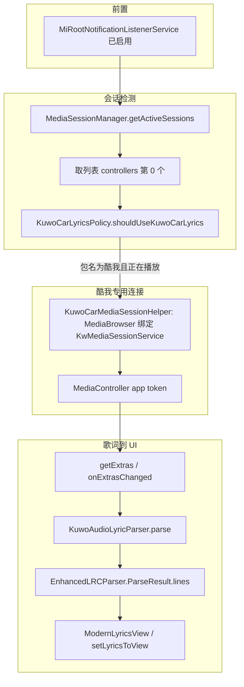

# 酷我车载歌词：接入逻辑与解析说明

本文汇总 **酷我音乐车载版**（包名 `cn.kuwo.kwmusiccar`）在 MiRoot 背屏歌词中的 **完整接入链路** 与 **`AUDIO_LYRIC` JSON 解析规则**。协议字段与酷我侧实现细节见仓库根目录《第三方应用获取歌词_MediaSession集成.md》；历史背景见《MiRoot与酷我车载歌词配合.md》。

---

## 1. 核心结论（数据从哪来）

| 项目 | 说明 |
|------|------|
| 歌词载体 | `MediaSession` 的 **Extras**，键名 **`AUDIO_LYRIC`**（`String`），值为 **整段 JSON** |
| 标准 `MediaMetadata` 歌词键 | 酷我通常 **不** 用常见 LYRICS 元数据键承载整首逐行词，不能只读 Metadata |
| 推荐第三方接入方式 | 使用 **`MediaBrowser`** 连接酷我已导出的 `KwMediaSessionService`，拿到 `Session.Token` 后构造 **`MediaController`**，并注册 **`onExtrasChanged`**（见下文 MiRoot 实现） |
| 成功展示条件 | JSON 中 **`resultCode == 20000`** 且 **`AUDIO_LYRIC` 数组非空**，且每行有非空 **`text`** |

---

## 2. MiRoot 整体接入架构

**要点：**

1. **通知监听权限** 仅用于满足系统对 `getActiveSessions(ComponentName(NotificationListener))` 的要求；酷我歌词正文仍来自 **MediaSession Extras**。
2. 是否走「酷我直连」由 **`getActiveSessions` 返回列表的第一个控制器** 决定：`KuwoCarLyricsPolicy.shouldUseKuwoCarLyrics(first)` 要求 **`first.getPackageName()` 为 `cn.kuwo.kwmusiccar`** 且 **`PlaybackState.state == STATE_PLAYING`**。
3. 条件满足时，`RearScreenLyricsActivity.setupMediaController` 会 **`KuwoCarMediaSessionHelper.connect`**：通过 `MediaBrowser` 连接  
   `ComponentName("cn.kuwo.kwmusiccar", "cn.kuwo.mod.mediaSession.KwMediaSessionService")`，在 `onConnected` 里用 `getSessionToken()` 创建 **直连酷我会话的 `MediaController`**，替换原先临时挂接的「列表首位」控制器，并 **`tryApplyKuwoLyricsFromCurrentExtras()`**。
4. 连接失败时 **`kuwoCarLyricsSessionActive = false`**，回退继续使用活跃列表首位控制器（可能拿不到 `AUDIO_LYRIC`）。
5. 播放状态与「是否应对酷我走 MediaBrowser」不一致时，`maybeRefreshMediaControllerForKuwoPolicy` 会调用 **`KuwoCarLyricsPolicy.maybeRefreshIfNeeded`** → 重新 **`setupMediaController`**（例如暂停、切应用）。

相关类：

| 类 | 职责 |
|----|------|
| `KuwoCarMediaSessionHelper` | `MediaBrowser` 绑定酷我服务、断开、回调主线程交付 `MediaController` |
| `KuwoCarLyricsPolicy` | 判断是否应对酷我直连、何时需要重绑 |
| `RearLyricsMediaSessionCallbacks` | 封装 `MediaController.Callback`，包含 **`onExtrasChanged`** |
| `RearScreenLyricsActivity` | `setupMediaController`、`registerMediaControllerCallbacks`、`tryApplyKuwoLyricsFromExtrasBundle`、`loadLyrics` 中酷我分支 |

---

## 3. 回调与 UI 更新路径

1. **`RearLyricsMediaSessionCallbacks.onExtrasChanged(Bundle)`**  
   仅在 **`kuwoCarLyricsSessionActive == true`** 时调用 **`tryApplyKuwoLyricsFromExtrasBundle(extras)`**。

2. **`tryApplyKuwoLyricsFromExtrasBundle`**  
   - 从 `extras` 读取 **`KuwoAudioLyricParser.EXTRA_AUDIO_LYRIC`（即 `"AUDIO_LYRIC"`）**；  
   - 调用 **`KuwoAudioLyricParser.parse(json)`**；  
   - 解析成功则在主线程写入 **`enhancedLyricLines`** 并 **`setLyricsToView`**。

3. **`loadLyrics`**（元数据变化等触发）在 **`kuwoCarLyricsSessionActive`** 为 true 时：  
   - **只** 从当前 **`mediaController.getExtras()`** 再解析一次 `AUDIO_LYRIC`；  
   - **不** 走通知里的歌词字符串、也 **不** 走 `MusicInfoHelper.getLyricsFromAPI` 的酷狗等第三方 API（与 `MusicInfoHelper` 中对酷我包名的跳过逻辑一致，见第 5 节）。

4. **专用解析失败后的兜底（与「歌词来源」设置无关，酷我车载统一行为）**  
   - 切歌后 **仅** 等待 `AUDIO_LYRIC`（`KuwoAudioLyricParser`），**不** 与网络 API / SuperLyric 并行抢结果（含 MediaBrowser 连接中的短暂窗口，按包名 `cn.kuwo.kwmusiccar` 识别）。  
   - `extras` 暂时为空时继续等待（最长约 30s）；**JSON 解析失败** 或等待超时后，按用户选择的来源模式兜底：  
     - **网络歌词**：网络 API（酷狗优先 → qsgc → lrclib/ovh）  
     - **智能切换**：同上，未命中再 SuperLyric  
     - **仅 SuperLyric**：仅 SuperLyric（不走网络 API）

---

## 4. `AUDIO_LYRIC` 解析逻辑（`KuwoAudioLyricParser`）

### 4.1 输入

- 参数：`audioLyricJson: String?`（即 Bundle 里 `AUDIO_LYRIC` 键对应的整段 JSON 文本）。

### 4.2 失败即返回 `null` 的情况

- `null`、空白、**JSON 解析异常**（内部 `try/catch` 吞掉异常并返回 `null`）。
- 顶层 **`resultCode != 20000`**（`20000` 表示酷我侧 SUCCESS，与反编译文档一致）。
- 顶层无 **`AUDIO_LYRIC`** 数组，或数组长度为 0。
- 数组内所有行 **`text` 去空白后为空**（空行被跳过；若全部被跳过则整段解析为 `null`）。

### 4.3 单行对象字段

| JSON 字段 | MiRoot 使用方式 |
|-------------|-----------------|
| `startTime` | 转为 **`EnhancedLRCParser.EnhancedLyricLine.time`**（毫秒，行起始时间） |
| `text` | 去首尾空白后作为 **`EnhancedLyricLine.text`**；空则跳过该行 |
| `time` | **当前解析器未使用**（酷我可用于行时长/间隔，MiRoot 仅用 `startTime` 排序与高亮） |

### 4.4 输出

- 成功时返回 **`EnhancedLRCParser.ParseResult`**，其中 **`lines`** 为 **`List<EnhancedLyricLine>`**。  
- 解析后会对 **`lines` 按 `time`（即 `startTime`）升序排序**，保证乱序 JSON 也能对齐时间轴。

### 4.5 单元测试约定（`KuwoAudioLyricParserTest`）

- `resultCode` 非 `20000` → `null`  
- 空数组 → `null`  
- 合法数据会 **排序**、并 **跳过空 `text` 行**

---

## 5. 与第三方歌词 API 的关系（`MusicInfoHelper`）

- 常量 **`KUWO_MUSIC_CAR_PACKAGE = "cn.kuwo.kwmusiccar"`**。  
- **`getLyricsFromAPI` / `fetchNetworkLyricsPayload`**：非酷我会话时按播放器包名走 `MusicPlayerLyricsPolicy`；酷我车载在 **`AUDIO_LYRIC` 专用解析失败之后** 由 `RearScreenLyricsActivity.beginKuwoLyricsFallbackAfterNativeFailed` 以包名 `cn.kuwo.kwmusiccar` 发起网络兜底。  
- **`getMusicInfoFromMediaController`** 仍主要读活跃会话的 **`MediaMetadata` 常见歌词键**，**不** 在此处解析 `AUDIO_LYRIC`；酷我整首词 **由背屏直连 Controller + `KuwoAudioLyricParser`** 负责。

---

## 6. 集成方自检清单（通用第三方也可对照）

1. 已安装酷我车载，且 **`KwMediaSessionService` 可绑定**（导出服务）。  
2. 已授予 **通知监听**（若使用 `MediaSessionManager.getActiveSessions` 方案）。  
3. 使用 **`MediaBrowser` + `MediaController`** 或等价方式拿到酷我会话 Token。  
4. 注册 **`MediaController.Callback.onExtrasChanged`**，并可在连接成功后 **`getExtras()`** 读首包。  
5. 解析 JSON：**`resultCode == 20000`** + **`AUDIO_LYRIC` 数组** → 映射到己方时间轴结构。  
6. **切歌** 时 extras 可能短暂为空或旧数据，建议结合 **`MediaMetadata` 的曲目标识** 做去旧逻辑。  
7. 酷我升级若变更 JSON 结构，需同步更新 **`KuwoAudioLyricParser`**。

---

## 7. 已知局限（MiRoot 当前行为）

- **是否启用酷我直连** 取决于 **`getActiveSessions` 列表的第一个会话**：若前台播放酷我但排序上不是首位，可能不会进入 `MediaBrowser` 酷我路径。  
- 多播放器并存时，仍以「系统返回的会话顺序」为准；更稳妥的做法是遍历列表 **按包名/Tag 选择酷我**（可参考《MiRoot与酷我车载歌词配合.md》中的建议，作为后续优化方向）。

---

## 8. 源码索引

| 路径 | 说明 |
|------|------|
| `lyrics/KuwoCarMediaSessionHelper.java` | 包名、服务类名、`MediaBrowser` 连接 |
| `lyrics/KuwoCarLyricsPolicy.kt` | 播放中 + 酷我包名 → 直连；重绑条件 |
| `lyrics/KuwoAudioLyricParser.kt` | JSON → `ParseResult` |
| `lyrics/RearLyricsMediaSessionCallbacks.kt` | `onExtrasChanged` 转发 |
| `lyrics/RearScreenLyricsActivity.java` | `setupMediaController`、`tryApplyKuwoLyricsFromExtrasBundle`、`loadLyrics` 酷我分支 |
| `lyrics/MusicInfoHelper.java` | 酷我包名跳过 `getLyricsFromAPI` |
| `lyrics/EnhancedLRCParser.java` | `EnhancedLyricLine`、`ParseResult` |
| `app/src/test/.../KuwoAudioLyricParserTest.kt` | 解析器单测 |
| 《第三方应用获取歌词_MediaSession集成.md》 | 酷我侧协议与 `resultCode` 表 |

---

*文档描述以当前仓库代码为准；若酷我官方 APK 变更协议，请以新版本为准并更新 `KuwoAudioLyricParser`。*
